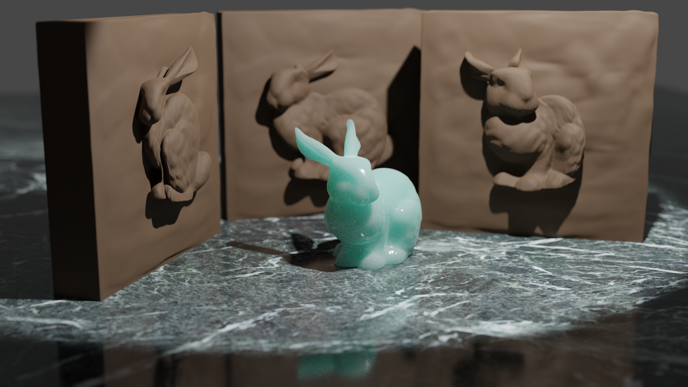

# Appearance Mimicking Surfaces
This repo is an libigl style implementation of the [Appearance Mimicking Surfaces](https://cims.nyu.edu/gcl/papers/mimicking-2014.pdf) paper by Christian Schüller, Daniele Panozzo, and Olga Sorkine-Hornung. 

Appearance-mimicking surfaces are thin surfaces whose normals approximate the normals of a 3D shape. Commonly seen examples of such surfaces are bas-reliefs. Given a viewpoint and per-vertex depth bounds, the algorithm finds a globally optimal surface that preserves the appearance of the target shape when observed from the designated viewpoint, while satisfying the depth constraints. 

(Results rendered using Blender)

**To get started:** 
 
     git clone --recursive http://github.com/[username]/appearance-mimicking-surfaces.git

## Compilation

Starting in the root project directory, issue:

    mkdir build
    cd build
    cmake ..
    make 

Debug in debug mode with assertions enabled:
 
     cmake -DCMAKE_BUILD_TYPE=Debug ../
 
Try out your code in _release mode_ for much better performance:

     cmake -DCMAKE_BUILD_TYPE=Release ../
For more details regarding project structure and setup, see
[introduction](http://github.com/alecjacobson/geometry-processing-introduction).

## Execution

Once built, you can execute the demo from inside the `build/` by running

    ./ams [path to mesh.obj] [path to matcap image]
The example uses [MatCaps](https://libigl.github.io/tutorial/#matcaps) to style the mesh and optionally uses MATLAB to process long-running computations for large meshes. If there are `matlab: Command not found` errors, try running 
     
     export PATH=/Applications/MATLAB_R2019b.app/bin/:$PATH
     

## Implementation
See https://luxi-zhao.github.io/appearance-mimicking-surfaces/.

