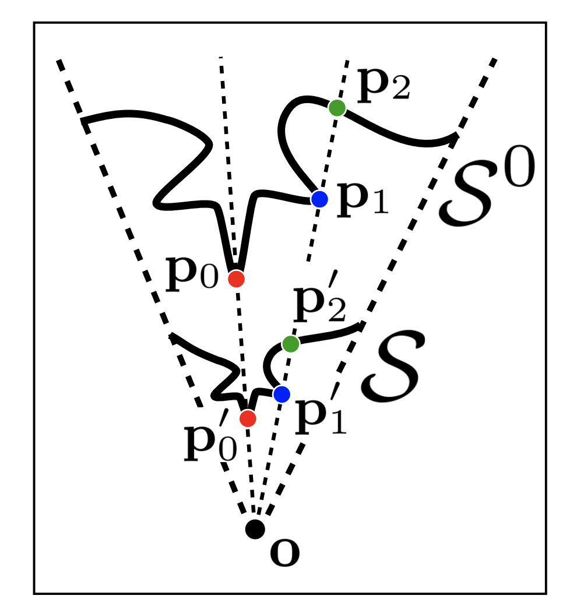
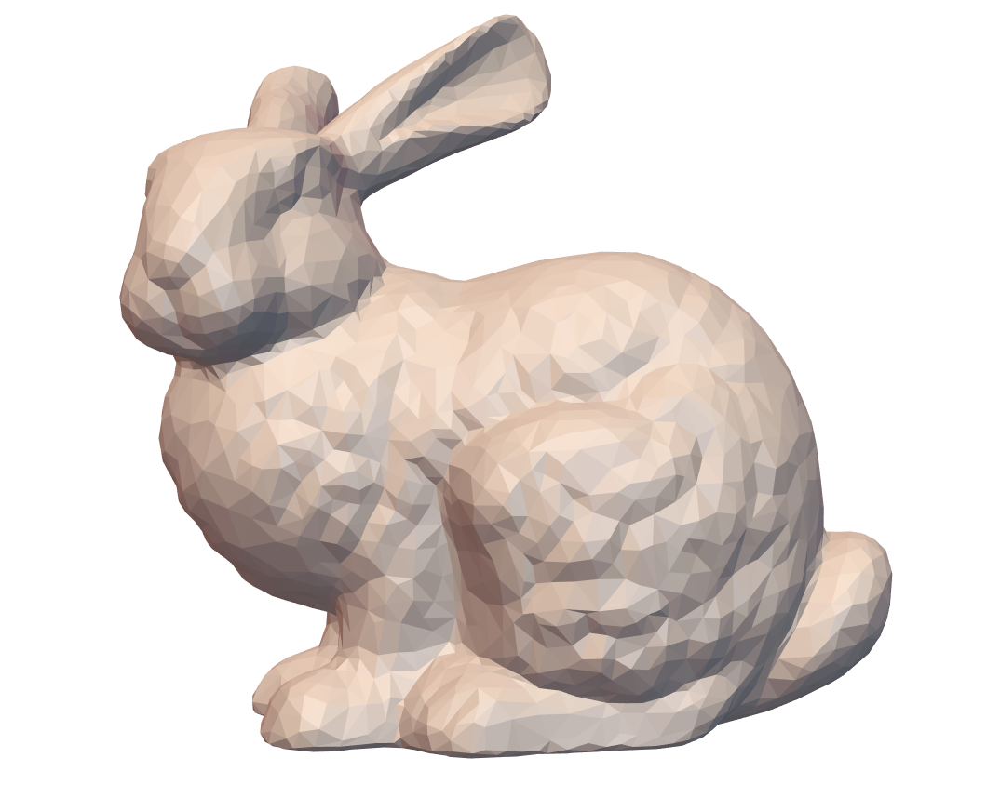
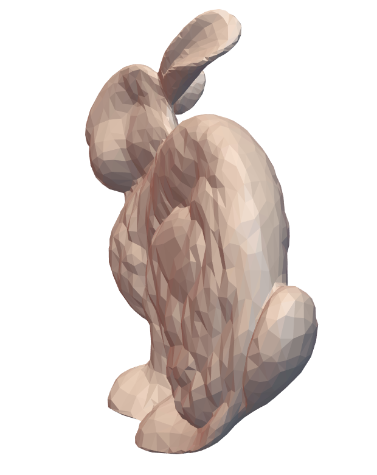
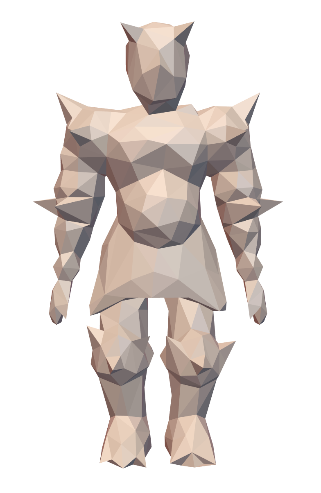
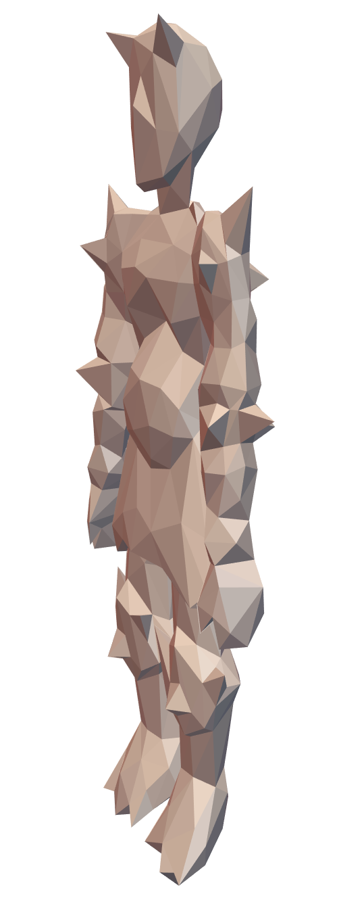
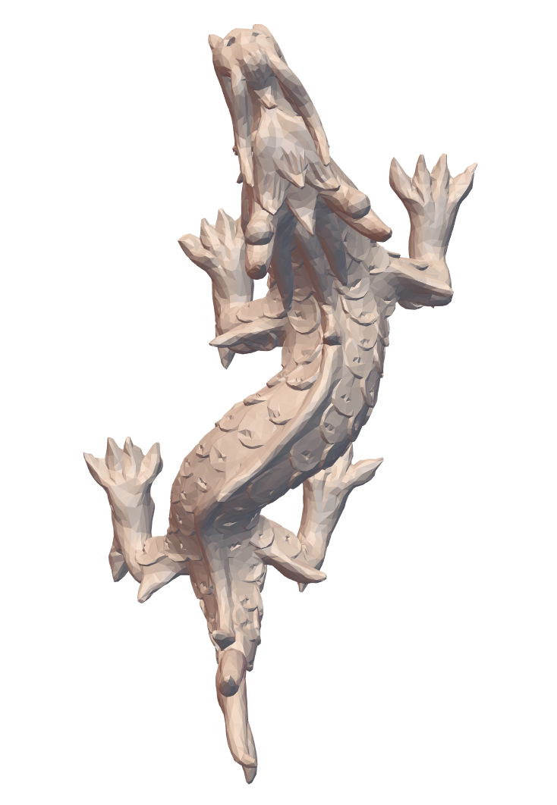
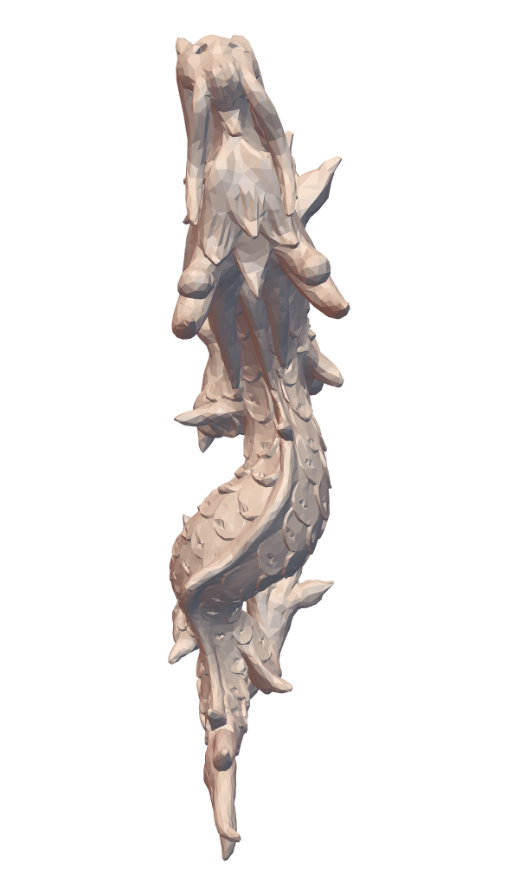

# Appearance-Mimicking Surfaces

Inspired by bas-reliefs, appearance-mimicking surfaces are thin surfaces, or 2.5D images whose normals approximate the normals of a 3D shape. Given a viewpoint and per-vertex depth bounds, the algorithm proposed [^1] finds a globally optimal surface that preserves the appearance of the target shape when observed from the designated viewpoint, while satisfying the depth constraints. 

## Problem Formulation

Let $S^{o}$ be the original surface, and $S$ be the deformed surface when observed from viewpoint $\bold{o}$. Each point $\bold{p}'$ of the deformed surface is constrained to stay on the ray emanating from the viewpoint in the direction of $\bold{p}$ (line $\bold{op}$).



The perceived difference $d(S, S^{o}, \bold{o})$ between $S^{o}$ and $S$ is measured by the sum of the L2 norm of their normals at each point:  
$$
d(S, S^{o}, \bold{o}) = \int_{S} \Vert \bold{n}^{S}_{\phi(\bold{p}, \bold{o})} - \bold{n}^{S^{o}}_\bold{p} \Vert^{2} d\bold{p}
$$
Here, $\phi(\bold{p}, \bold{o}) = \bold{p}'$ on surface $S$. $\bold{n}^{S^{o}}_\bold{p}$ is the normal of $S^{o}$ at point $\bold{p}$. Our goal is to minimize $d(S, S^{o}, \bold{o})$.

## Discretization

When surface $S$ is represented by a triangle mesh $M$,  points $p'$ on $S$ are approximated by vertices $\bold{v}_i$. Each vertex $\bold{v}_i$ can be written as:
$$
\bold{v}_i = \bold{o} + \Vert \bold{v}_i - \bold{o} \Vert \frac{\bold{v}_i - \bold{o}}{\Vert \bold{v}_i - \bold{o} \Vert} = \bold{o} + \lambda_i \bold{\hat{v}}_i
$$
$\bold{\hat{v}}_i$ is the unit vector pointing in the direction of $\bold{ov_i}$. $\lambda_i$ measures the distance between $\bold{o}$ and $\bold{v}_i$. This representation is convenient because $M$ (deformed mesh) and $M^o$ (original mesh) share the same set of $\bold{\hat{v}}_i$. Their differences are solely expressed by $\lambda_i$ and $\lambda_i^o$. Depth constraints for each vertex of $M$ can be specified as a upper bound and a lower bound on $\lambda_i$:
$$
\lambda^{min}_i \leq \lambda_i \leq \lambda^{max}_i
$$


Using this representation, Eq. (1) can be discretized and linearized as:
$$
\begin{align*}
d(M, M^o, \bold{o}) = \sum_{i \in \bold{V}} w_i^2 A_i \Vert\bold{n}_i - \bold{n}_i^o \Vert^2 \\

&= \sum_{i \in \bold{V}} w_i^2 A_i \Vert\frac{(\bold{L} \bold{V})_i}{H_i} - \frac{(\bold{L}^o \bold{V}^o)_i}{H_i^o} \Vert^2 \\

&= \sum_{i \in \bold{V}} w_i^2 A_i \Vert\frac{(\bold{L} \bold{D}_\lambda \bold{\hat{V}})_i}{H_i} - \frac{(\bold{L}^o \bold{D}_{\lambda^o} \bold{\hat{V}})_i}{H_i^o} \Vert^2 \\

&= \sum_{i \in \bold{V}} w_i^2 A_i^o \Vert\frac{(\bold{L}^o \bold{D}_\lambda \bold{\hat{V}})_i}{H_i^o} - \frac{(\bold{L}^o \bold{D}_{\lambda^o} \bold{\hat{V}})_i}{H_i^o} \frac{\lambda_i}{\lambda_i^o}\Vert^2 \\ 

&= \sum_{i \in \bold{V}} w_i^2 A_i^o \Vert(\bold{L}^o \bold{D}_\lambda \bold{\hat{V}})_i - (\bold{L}^o \bold{D}_{\lambda^o} \bold{\hat{V}})_i \frac{\lambda_i}{\lambda_i^o}\Vert^2 \\ 

\end{align*}
$$
$A_i$ is the Voronoi area ssociated with $\bold{v}_i$ and can be obtained from the mass matrix coefficients. $w_i$ are weights denoting the relative importance of $\bold{v}_i$. Visible vertices from the viewpoint are given more weight than occluded vertices. By default $w_i$ are 1. $\bold{L}$ is the discrete laplace operator of mesh $M$. $\bold{D}_\lambda$ is a diagonal matrix with entries $\lambda_i$ on the diagonal. 

> We follow these conventions for notations:
>
> * If $\bold{X}$ is a property/operator for mesh $M$, then $\bold{X}^o$ is the corresponding property/operator for mesh $M^o$.
> * If $\bold{x}$ is a vector, then $\bold{D_x}$ is a diagonal matrix with $\bold{x}$ on the diagonal.   

Now our goal is to find $\lambda$ such that it minimizes $d(M, M^o, \bold{o})$. To do this, we extract the unknown variable $\bold{\lambda}$ from $\bold{D}_\lambda$. The above equation can be further vectorized as:
$$
d(M, M^o, \bold{o}) = \Vert \bold{D}_\sqrt{A^o} \bold{D}_w (\bold{\tilde{L}}^o \bold{D_\hat{V}} - \bold{D}_{\bold{L}_\theta}) \bold{S} \bold{\lambda} \Vert^2

= \Vert \bold{Q} \bold{\lambda} \Vert^2
$$

$$
\bold{L}_\theta = \bold{D_{(S \lambda_o)}}^{-1} \bold{\tilde{L}}^o \bold{D_\hat{V}} \bold{S} \bold{\lambda}^o
$$

We then construct all the components of matrix $\bold{Q} = \bold{D}_\sqrt{A^o} \bold{D}_w (\bold{\tilde{L}}^o \bold{D_\hat{V}} - \bold{D}_{\bold{L}_\theta}) \bold{S}$.

Let $n = |\bold{V}^o|$, 

* $\bold{D}_\sqrt{A^o}$ is a 3n x 3n matrix with the square root of mass matrix coefficients repeated 3 times (1 for each dimension) on the diagonal. 
* $\bold{D}_w$ is a 3n x 3n matrix with the weight vector $\bold{w}$ repeated 3 times on the diagonal.
* $\bold{\tilde{L}}^o$, also 3n x 3n, is the Kronecker product between the cotangent matrix and 3 x 3 identity matrix: $\bold{\tilde{L}}^o = \bold{L}^o \otimes \bold{I}_3$
* $\bold{S}$ is a 3n x n selector matrix that associates each $\lambda_i$ with the x, y, z coordinates of $\bold{v}_i$: $\bold{I}_n \otimes [1,1,1]^T$

Aside from depth constraints, we also need to fix the value of $\lambda_k$ for one vertex $\bold{v}_k$ to obtain a unique solution. $\lambda_k$ is a pre-calculated value $b$ passed into the algorithm.

We now have quadratic programming problem that can be solved using the libigl active set solver:
$$
\begin{align*}
& \min_{\bold{\lambda}, \bold{\mu}} \Vert \bold{Q} \bold{\lambda} \Vert^2\\
\\
& \text{subject to } \\ 
& \bold{\lambda}^{min} \leq \bold{\lambda} \leq \bold{\lambda}^{max} \\
& \lambda_k = b

\end{align*}
$$

```c++
igl::active_set_params as;
Eigen::VectorXd lambda; // n x 1

// Q - D_A * D_w * (L_tilde0 * D_v_hat - D_L_theta) * S, 3n x n
// B - linear coefficients, set to 0
// b - index of lambda to be fixed
// Y - value of the fixed lambda
// Aeq, Beq, Aieq, Bieq - empty matrices
// lx, ux - upper and lower lambda bounds
igl::active_set(Q.transpose() * Q, B, b, Y, Aeq, Beq, Aieq, Bieq, lx, ux, as, lambda);
```

For further implementation details, see `main.cpp`, which creates appearance-mimicking surfaces of the input mesh from 3 pre-defined viewpoints.  

## Demo

| Original Mesh                                                | Deformed Mesh                                                | Original Mesh                                                | Deformed Mesh                                                | Original Mesh                                                | Deformed Mesh                                                |
| ------------------------------------------------------------ | ------------------------------------------------------------ | ------------------------------------------------------------ | ------------------------------------------------------------ | ------------------------------------------------------------ | ------------------------------------------------------------ |
|  |  |  |  |  |  |

​																	The example `main.cpp` deforms a mesh along the z-axis. 

## References

[^1]: Christian Schuller, Daniele Panozzo, Olga Sorkine-Hornung, [*Appearance-Mimicking Surfaces*](https://cims.nyu.edu/gcl/papers/mimicking-2014.pdf), 2014

[^2]: Mark Meyer, Mathieu Desbrun, Peter Schröder and Alan H. Barr, [Discrete Differential-Geometry Operators for Triangulated 2-Manifolds](https://www.google.com/search?q=Discrete+Differential-Geometry+Operators+for+Triangulated+2-Manifolds), 2003.

