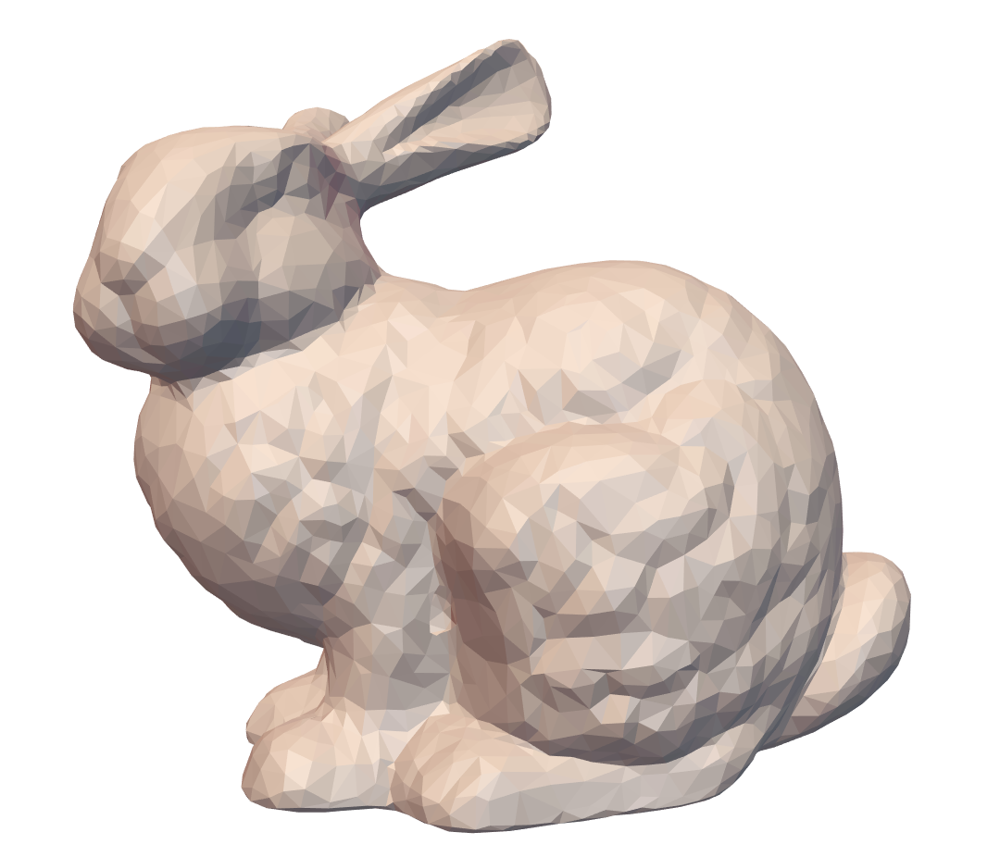

# Appearance-Mimicking Surfaces

Inspired by bas-reliefs, appearance-mimicking surfaces are thin surfaces, or 2.5D images whose normals approximate the normals of a 3D shape. Given a viewpoint and per-vertex depth bounds, the algorithm proposed [^1] finds a globally optimal surface that preserves the appearance of the target shape when observed from the designated viewpoint, while satisfying the depth constraints. 

## Problem Formulation

Let $S^{o}$ be the original surface, and $S$ be the deformed surface when observed from viewpoint $\bold{o}$. Each point $\bold{p}'$ of the deformed surface is constrained to stay on the ray emanating from the viewpoint in the direction of $\bold{p}$ (line $\bold{op}$).


The perceived difference $d(S, S^{o}, \bold{o})$ between $S^{o}$ and $S$ is measured by the sum of the L2 norm of their normals at each point:  
$$
d(S, S^{o}, \bold{o}) = \int_{S} \Vert \bold{n}^{S}_{\phi(\bold{p}, \bold{o})} - \bold{n}^{S^{o}}_\bold{p} \Vert^{2} d\bold{p}
$$
Here, $\phi(\bold{p}, \bold{o}) = \bold{p}'$ on surface $S$. $\bold{n}^{S^{o}}_\bold{p}$ is the normal of $S^{o}$ at point $\bold{p}$. Our goal is to minimize $d(S, S^{o}, \bold{o})$.

## Discretization

#### Preserving Surface Similarity

When surface $S$ is represented by a triangle mesh $M$,  points $p'$ on $S$ are approximated by vertices $\bold{v}_i$. Each vertex $\bold{v}_i$ can be written as:
$$
\bold{v}_i = \bold{o} + \Vert \bold{v}_i - \bold{o} \Vert \frac{\bold{v}_i - \bold{o}}{\Vert \bold{v}_i - \bold{o} \Vert} = \bold{o} + \lambda_i \bold{\hat{v}}_i
$$
$\bold{\hat{v}}_i$ is the unit vector pointing in the direction of $\bold{ov_i}$. $\lambda_i$ measures the distance between $\bold{o}$ and $\bold{v}_i$. This representation is convenient because $M$ (deformed mesh) and $M^o$ (original mesh) share the same set of $\bold{\hat{v}}_i$. Their differences are entirely expressed by $\lambda_i$ and $\lambda_i^o$. Depth constraints for each vertex of $M$ can be specified as a upper bound and a lower bound on $\lambda_i$:
$$
\lambda^{min}_i \leq \lambda_i \leq \lambda^{max}_i
$$


Using this representation, Eq. (1) can be discretized and linearized as:
$$
\begin{align*}
d(M, M^o, \bold{o}) = \sum_{i \in \bold{V}} w_i^2 A_i \Vert\bold{n}_i - \bold{n}_i^o \Vert^2 \\

&= \sum_{i \in \bold{V}} w_i^2 A_i \Vert\frac{(\bold{L} \bold{V})_i}{H_i} - \frac{(\bold{L}^o \bold{V}^o)_i}{H_i^o} \Vert^2 \\

&= \sum_{i \in \bold{V}} w_i^2 A_i \Vert\frac{(\bold{L} \bold{D}_\lambda \bold{\hat{V}})_i}{H_i} - \frac{(\bold{L}^o \bold{D}_{\lambda^o} \bold{\hat{V}})_i}{H_i^o} \Vert^2 \\

&= \sum_{i \in \bold{V}} w_i^2 A_i^o \Vert\frac{(\bold{L}^o \bold{D}_\lambda \bold{\hat{V}})_i}{H_i^o} - \frac{(\bold{L}^o \bold{D}_{\lambda^o} \bold{\hat{V}})_i}{H_i^o} \frac{\lambda_i}{\lambda_i^o}\Vert^2 \\ 

&= \sum_{i \in \bold{V}} w_i^2 A_i^o \Vert(\bold{L}^o \bold{D}_\lambda \bold{\hat{V}})_i - (\bold{L}^o \bold{D}_{\lambda^o} \bold{\hat{V}})_i \frac{\lambda_i}{\lambda_i^o}\Vert^2 \\ 

\end{align*}
$$
$A_i$ is the Voronoi area ssociated with $\bold{v}_i$ and can be obtained from the mass matrix coefficients. $w_i$ are weights denoting the relative importance of $\bold{v}_i$. Visible vertices from the viewpoint are given more weight than occluded vertices. By default $w_i$ are 1. $\bold{L}$ is the discrete laplace operator of mesh $M$. $\bold{D}_\lambda$ is a diagonal matrix with entries $\lambda_i$ on the diagonal. 

> We follow these conventions for notations:
>
> * If $\bold{X}$ is a property/operator for mesh $M$, then $\bold{X}^o$ is the corresponding property/operator for mesh $M^o$.
> * If $\bold{x}$ is a vector, then $\bold{D_x}$ is a diagonal matrix with $\bold{x}$ on the diagonal.   

Now our goal is to find $\lambda$ such that it minimizes $d(M, M^o, \bold{o})$. To do this, we extract the unknown variable $\bold{\lambda}$ from $\bold{D}_\lambda$. The above equation can be further vectorized as:
$$
d(M, M^o, \bold{o}) = \Vert \bold{D}_\sqrt{A^o} \bold{D}_w (\bold{\tilde{L}}^o \bold{D_\hat{V}} - \bold{D}_{\bold{L}_\theta}) \bold{S} \bold{\lambda} \Vert^2

= \Vert \bold{Q} \bold{\lambda} \Vert^2
$$

$$
\bold{L}_\theta = \bold{D_{(S \lambda_o)}}^{-1} \bold{\tilde{L}}^o \bold{D_\hat{V}} \bold{S} \bold{\lambda}^o
$$

We then construct all the components of matrix $\bold{Q} = \bold{D}_\sqrt{A^o} \bold{D}_w (\bold{\tilde{L}}^o \bold{D_\hat{V}} - \bold{D}_{\bold{L}_\theta}) \bold{S}$.

Let $n = |\bold{V}^o|$, 

* $\bold{D}_\sqrt{A^o}$ is a 3n x 3n matrix with the square root of mass matrix coefficients repeated 3 times (1 for each dimension) on the diagonal. 
* $\bold{D}_w$ is a 3n x 3n matrix with the weight vector $\bold{w}$ repeated 3 times on the diagonal.
* $\bold{\tilde{L}}^o$, also 3n x 3n, is the Kronecker product between the cotangent matrix and 3 x 3 identity matrix: $\bold{\tilde{L}}^o = \bold{L}^o \otimes \bold{I}_3$
* $\bold{S}$ is a 3n x n selector matrix that associates each $\lambda_i$ with the x, y, z coordinates of $\bold{v}_i$: $\bold{I}_n \otimes [1,1,1]^T$

#### Allowing Disconnected Pieces

Some meshes are composed of disconnected pieces. There might be use cases where each deformed piece needs to occupy a different location. In this case, the $\bold{\lambda}$ bounds need to be discontinuous as well. For example, suppose mesh A is a "connected" mesh with 4 vertices. Its $\bold{\lambda}$ bounds  could be:

* $\bold{\lambda}_{min}$: 10, 10, 10, 10
* $\bold{\lambda}_{max}$: 11, 11, 11, 11

Suppose mesh B is a "disconnected" mesh with 4 vertices and 2 vertex groups. Its $\bold{\lambda}$ bounds could be:

* $\bold{\lambda}_{min}$: 10, 10, 11, 11
* $\bold{\lambda}_{max}$: 11, 11, 12, 12

This complicates user input because users need to calculate different bounds for different vertex groups. To simplify user input for this use case, the paper introduces a vector $\bold{\mu}$, where each element $\mu_g$ is a scaling factor for an independent group of vertices such that $\mu_g \lambda^{min}_i \leq \lambda_i \leq \mu_g \lambda^{max}_i$ holds for all vertices $i$ in group $g$. $|\bold{\mu}| =$ number of groups. 

To obtain a unique solution for $\mu_g$, for each group $g$, we can fix the value of $\lambda_{gk}$ for a (randomly selected) vertex $\bold{v}_{gk}$. The value of $\lambda_{gk}$ then affects the value of $\mu_g$.

#### Optimization

Finally, we optimize for both $\lambda$ and $\mu$:
$$
\begin{align*}
& \min_{\bold{\lambda}, \bold{\mu}} \Vert \bold{Q} \bold{\lambda} \Vert^2 + \alpha \Vert \bold{\mu} \Vert^2 \\
\\
& \text{subject to } \\ 
& \bold{C}_I [\lambda \;\; \mu]^T \le \bold{d} \\
& \bold{C}_E [\lambda \;\; \mu]^T = \bold{b} \\
\end{align*}
$$
$\alpha$ Is set to $10^{-7}$ in the paper. $\bold{C}_I$ are the inequality constraints derived from $\mu_g \lambda^{min}_i \leq \lambda_i \leq \mu_g \lambda^{max}_i$. $\bold{C}_E$ are the equality constraints derived from fixing $\lambda_{gk}$.

Combining $\bold{\lambda}$ and $\bold{\mu}$ into one unknown vector $\bold{x}$, we now have quadratic programming problem that can be solved using the libigl active set solver:

```c++
igl::active_set_params as;
Eigen::VectorXd x; // (n + |mu|) x 1

// B - linear coefficients, set to 0
// b - index of lambdas to be fixed
// Y - value of the fixed lambdas
// Aeq, Beq - empty matrices
// Aieq - inequality constraint matrix C_I
// Bieq - inequality constraint d, set to a 0 vector with dimension (n + |mu|) x 1
// lx, ux - empty vectors
// x - [lambda; mu]
igl::active_set(F.transpose() * F, B, b, Y, Aeq, Beq, Aieq, Bieq, lx, ux, as, x);
```

where F is:
$$
F = 
\begin{bmatrix}
\bold{Q} & \bold{0} \\
\bold{0} & \sqrt{\alpha} \cdot \bold{I}
\end{bmatrix}
$$
The deformed vertices are retrieved by multiplying each $\lambda_i$ with $\mu_g$. 

## Demo

| Original Mesh                                                | Deformed Mesh                                                | Original Mesh                                                | Deformed Mesh                                                | Original Mesh                                                | Deformed Mesh                                                |
| ------------------------------------------------------------ | ------------------------------------------------------------ | ------------------------------------------------------------ | ------------------------------------------------------------ | ------------------------------------------------------------ | ------------------------------------------------------------ |
|  |  |  |  |  |  |

​													The example `main.cpp` deforms a mesh along the z-axis (front view). 

## Implementation Details

#### Getting $\bold{D}_\sqrt{A^o}$  

* Dimension: 3n x 3n

First, we construct a mass matrix $\bold{M}$:

```c++
Eigen::SparseMatrix<double> M;
igl::massmatrix(V, F, igl::MASSMATRIX_TYPE_VORONOI, M);
```

Here, $\bold{M}$ is a diagonal matrix, in which the diagonal entry $M_{ii}$ is the Voronoi area around $\bold{v}_i$ in the mesh [^2]. We then take the diagonal entry for each vertex, take the square root, and repeat it 3 times (1 for each dimension).  The resulting matrix $\bold{D}_\sqrt{A^o}$ should look like this:
$$
\bold{D}_\sqrt{A^o} =
\begin{bmatrix}
\sqrt{M_{00}} & 0 & \dots &  &  &	 &	& 0\\
0 						& \sqrt{M_{00}} &  &  &  &  & &\vdots \\
 						& 							& \sqrt{M_{00}} \\
 						& 							&  				& \sqrt{M_{11}} \\
 						& 							&  				&  					& \sqrt{M_{11}} \\
 						& 							&  				&  					&  						& \sqrt{M_{11}} \\
\vdots 				& 							&  				&  					&  						&  & \ddots \\
0 						& 0							&  \dots	&  					&  						& 0 & \dots & \sqrt{M_{n-1,n-1}}
\end{bmatrix}
$$


#### Getting $\bold{D}_w$

* Dimension: 3n x 3n

Similar to $\bold{D}_\sqrt{A^o}$, we take the weight vector $w$ of size n x 1 and repeat it along the diagonal:
$$
\bold{D}_w =
\begin{bmatrix}
w_0 & 0 & \dots &  &  &	 &	& 0\\
0 						& w_0 &  &  &  &  & &\vdots \\
 						& 							& w_0 \\
 						& 							&  				& w_1 \\
 						& 							&  				&  					& w_1 \\
 						& 							&  				&  					&  						& w_1 \\
\vdots 				& 							&  				&  					&  						&  & \ddots \\
0 						& 0							&  \dots	&  					&  						& 0 & \dots & w_{n-1}
\end{bmatrix}
$$

#### Getting $\bold{\tilde{L}}^o$

* Dimension: 3n x 3n

First, we compute the cotangent Laplace-Beltrami operator $\bold{L}^o$:

```c++
Eigen::SparseMatrix<double> cot, M_inv, L;
igl::cotmatrix(V, F, cot);
igl::invert_diag(M, M_inv);
L = M_inv * cot;
```

$\bold{\tilde{L}}^o$ is the Kronecker product between the cotangent matrix and 3 x 3 identity matrix:
$$
\bold{\tilde{L}}^o = \bold{L}^o \otimes \bold{I}_3
$$

$$
\bold{\tilde{L}}^o =
\begin{bmatrix}

\begin{bmatrix} 
\textbf{L}^o_{00} && \\
&\textbf{L}^o_{00}& \\
&&\textbf{L}^o_{00} \\
\end{bmatrix} & \dots  &

\begin{bmatrix} 
\textbf{L}^o_{0,n-1} && \\
&\textbf{L}^o_{0,n-1}& \\
&&\textbf{L}^o_{0,n-1} \\
\end{bmatrix}\\
\vdots & \ddots  &\vdots \\
\begin{bmatrix} 
\textbf{L}^o_{n-1,0} && \\
&\textbf{L}^o_{n-1,0}& \\
&&\textbf{L}^o_{n-1,0} \\
\end{bmatrix} & & 

\begin{bmatrix} 
\textbf{L}^o_{n-1,n-1} && \\
&\textbf{L}^o_{n-1,n-1}& \\
&&\textbf{L}^o_{n-1,n-1} \\
\end{bmatrix}	 \\

\end{bmatrix}
$$


#### Getting $\bold{S}$

* Dimension: 3n x n
* $\bold{S}$ is a selector matrix that associates each $\lambda_i$ with the x, y, z coordinates of $\bold{v}_i$: $\bold{I}_n \otimes [1,1,1]^T$

$$
\begin{bmatrix}

\begin{bmatrix} 
1 \\
1\\
1 \\
\end{bmatrix} & \dots & 0 \\
\vdots & \ddots  &\vdots \\
0 & \dots & 

\begin{bmatrix} 
1\\
1\\
1\\
\end{bmatrix}	 \\

\end{bmatrix}
$$

#### Getting $\bold{C}_I$

* Dimension: 2n x (n + $|\mu|$)

We construct $\bold{C}_I$ such that $\mu_g \lambda^{min}_i \leq \lambda_i \leq \mu_g \lambda^{max}_i$ can be transformed into $\bold{C}_I [\lambda \;\; \mu]^T \le \bold{0}$. Below is an example of an inequality constraint for a mesh with 4 vertices and 2 groups. 
$$
\begin{bmatrix}

-1 & 0 & 0 & 0 & \lambda_{min,00} & 0 \\
0 & -1 & 0 & 0 & \lambda_{min,01} & 0 \\
0 & 0 & -1 & 0 & 0 & \lambda_{min,10} \\
0 & 0 & 0  & -1 & 0 & \lambda_{min,11} \\
1 & 0 & 0 & 0 & -\lambda_{max,00} & 0 \\
0 & 1 & 0 & 0 & -\lambda_{max,01} & 0 \\
0 & 0 & 1 & 0 & 0 & -\lambda_{max,10} \\
0 & 0 & 0 & 1 & 0 & -\lambda_{max,11} \\

\end{bmatrix}

\begin{bmatrix}
\lambda_0 \\
\lambda_1 \\
\lambda_2 \\
\lambda_3 \\
\mu_0 \\
\mu_1 \\
\end{bmatrix}

\le

\bold{0}

$$


#### Getting Bounds on $\bold{\lambda}$


Bounds for $\lambda_i$ varies for each vertex and each mesh. We first compute a bounding box [^3] for the mesh to help with customizing $\lambda$ bounds. 


The above figure shows how `main.cpp` deforms a mesh from a left viewpoint. We assume the mesh faces the positive z-axis and the bounding box is roughly square. 
$$
\begin{align*}
& \lambda_{max} = |OG|\\
& \lambda_{min} = |OE|\\
& (\lambda_i \bold{\hat{v}}_i) \; \cdot \; \bold{\hat{n}}_i \le \lambda_{max} 
\rightarrow 
\lambda_i \le \lambda_{max} / (\bold{\hat{v}}_i \; \cdot \; \bold{\hat{n}}_i)\\

& (\lambda_i \bold{\hat{v}}_i) \; \cdot \; \bold{\hat{n}}_i \ge \lambda_{min} 
\rightarrow 
\lambda_i \ge \lambda_{min} / (\bold{\hat{v}}_i \; \cdot \; \bold{\hat{n}}_i)\\

& lowerbound = \lambda_{max} / (\bold{\hat{v}}_i \; \cdot \; \bold{\hat{n}}_i) \\
& upperbound = \lambda_{min} / (\bold{\hat{v}}_i \; \cdot \; \bold{\hat{n}}_i)
\end{align*}
$$

## Future Directions & Challenges

Although $\bold{\mu}$ frees the user from specifying individual depth constraints for each disconnected piece, I am still having trouble producing disconnected appearance mimicking surfaces. If the input mesh is all connected (like the bunny), I am not sure how to break up the faces after breaking the vertices into mulitple groups. If the input mesh has disconnected pieces, I am not sure how to determine which vertices belong to the same group, other than manually inspecting the mesh file.          

## References

[^1]: Christian Schuller, Daniele Panozzo, Olga Sorkine-Hornung, [*Appearance-Mimicking Surfaces*](https://cims.nyu.edu/gcl/papers/mimicking-2014.pdf), 2014

[^2]: Mark Meyer, Mathieu Desbrun, Peter Schröder and Alan H. Barr, [Discrete Differential-Geometry Operators for Triangulated 2-Manifolds](https://www.google.com/search?q=Discrete+Differential-Geometry+Operators+for+Triangulated+2-Manifolds), 2003.

[^3]: Libigl tutorial on bounding boxes: https://github.com/libigl/libigl/blob/master/tutorial/105_Overlays/main.cpp